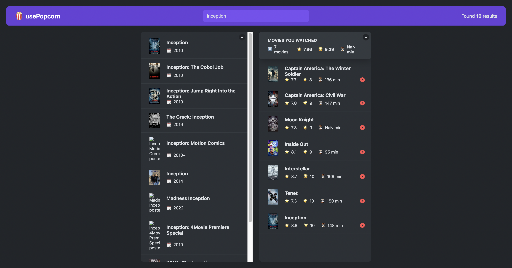

# Travel packing list - build with React

A web application based on React, integrated with the OMDb API, allowing users to search for movies and view detailed information. Users can enter a movie name to search through the application, which calls the OMDB API and returns detailed information about the movie, such as title, director, actors, plot summary, and poster. Additionally, users can rate movies they have watched and add them to a personal list for future viewing and management.

- Screenshot:
  
  

## Built with

- React

## Runs the app

```Shell
npm start
```

- Runs the app in the development mode.
- Open [http://localhost:3000](http://localhost:3000) to view it in your browser.

- The page will reload when you make changes.
- You may also see any lint errors in the console.

## Links

- Live Site URL: [live site URL here](https://popcorn-seemovie.netlify.app/)

## Author

- The Ultimate React Course 2024: React, Redux & More by Jonas Schmedtmann
- My GitHub - [YACodingroom](https://github.com/YAcodingroom)

## Acknowledgments

- Ivy & Ciao
- YAL me
- Dr.Angela & Jonas
